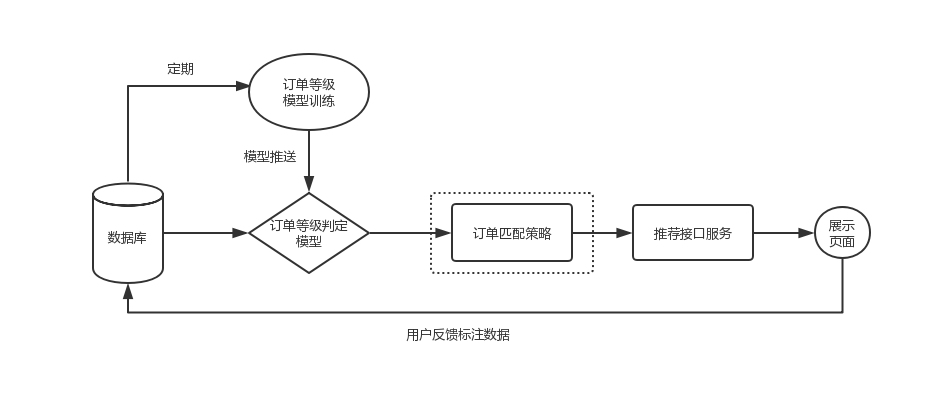
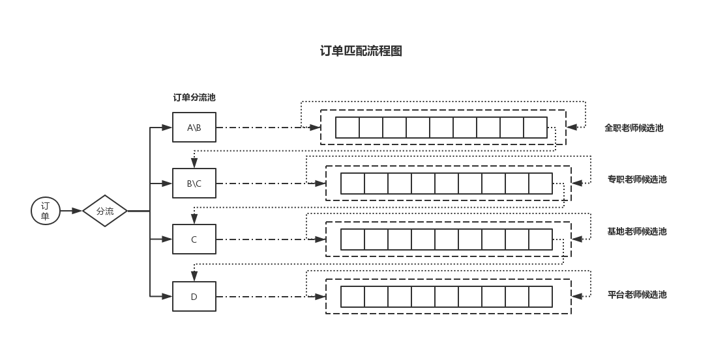

# 订单匹配策略模型

## 需求描述
结合现有教师信息，对试听课订单进行实时分配，以提高订单转化率。

## 推荐服务整体结构

流程说明  
1. 实时订阅数据库中的订单信息，通过等级判定模型决策订单等级  
2. 根据订单等级及老师实时状态信息，策略模型选取合适老师并推荐其相应ID  
3. 接口服务格式化推荐结果，提供给线上服务  

## 匹配策略模型结构

流程说明  
1. 根据订单等级导流至对应分流池  
2. 根据分流池优先级将池内订单消费至对应教师候选池，  
   如果未达到指定老师数量，则从当前候选池出发依次遍历下层候选池中老师，直到数量满足或无候选池  
3. 更新候选池内老师的顺序状态，达到月业绩上线则移动至备用候选池  
4. 定期统计各候选池老师任务完成量以更新分流策略，定时检测新增老师并添加进对应候选池
